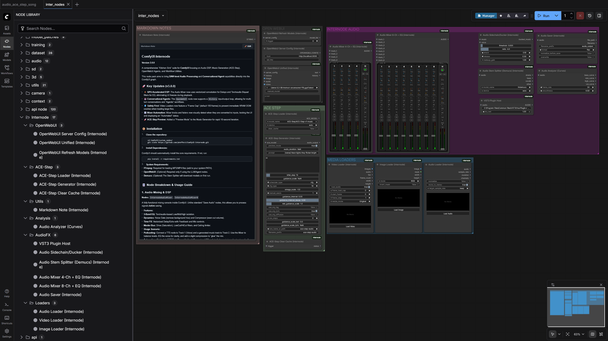

# ComfyUI-Internode

   



**ComfyUI-Internode** is a professional-grade Audio & Multimodal Workstation designed specifically for the ComfyUI ecosystem. It fundamentally transforms ComfyUI from an image-generation tool into a full-fledged **Generative Digital Audio Workstation (DAW)**.

While standard audio nodes in ComfyUI typically offer simple playback or basic saving capabilities, Internode provides a complete signal processing pipeline. It integrates high-fidelity DSP mixing, VST3 plugin hosting, native AI music generation (ACE-Step), spectral editing, advanced LLM integration via OpenWebUI, and a suite of Video FX tools for content creation.

This suite is engineered for power users who require precise control over audio signal chains, creating a complete **"Studio inside ComfyUI."**

---

## 📋 Table of Contents

1.  [📥 Installation & Setup](#-installation--setup)
    *   [Cloning the Repository](#1-cloning-the-repository)
    *   [Dependency Management](#2-dependency-management)
    *   [System Prerequisites (FFmpeg & VSTs)](#3-system-prerequisites)
2.  [🏗️ System Architecture](#-system-architecture)
    *   [The Dual-Engine Concept](#the-dual-engine-concept)
    *   [Data Flow](#data-flow)
3.  [🎛️ Section 1: The DSP Mixing Engine](#-section-1-the-dsp-mixing-engine)
    *   [The Channel Strip](#the-channel-strip)
    *   [The Master Bus](#the-master-bus)
    *   [Media Loaders & Savers](#media-loaders--savers)
4.  [🔌 Section 2: VST3 Integration (The Studio)](#-section-2-vst3-integration-the-studio)
    *   [Studio Surface (Interactive Synth)](#-studio-surface-interactive-synth)
    *   [VST Instruments (MIDI)](#vst-instruments-midi)
    *   [VST Effects](#vst-effects)
    *   [Parameter Automation](#parameter-automation)
5.  [🎼 Section 3: Generative Audio & Music](#-section-3-generative-audio--music)
    *   [ACE-Step Music Generation](#ace-step-music-generation)
    *   [Synthesis & Ambience](#synthesis--ambience)
6.  [📊 Section 4: Audio Reactivity & Video Sync](#-section-4-audio-reactivity--video-sync)
7.  [🌈 Section 5: Spectral Manipulation (Audio Inpainting)](#-section-5-spectral-manipulation-audio-inpainting)
8.  [🤖 Section 6: OpenWebUI (LLM Intelligence)](#-section-6-openwebui-llm-intelligence)
    *   [Core Chat & Configuration](#core-chat--configuration)
    *   [Text Intelligence](#text-intelligence)
    *   [Vision Intelligence](#vision-intelligence)
    *   [Video Intelligence](#video-intelligence)
    *   [Audio Intelligence](#audio-intelligence)
9.  [🎥 Section 7: Video FX & Post-Production](#-section-7-video-fx--post-production)
    *   [Players & Comparators](#players--comparators)
    *   [Color, Grain & Glitch](#color-grain--glitch)
    *   [Smart Video Processing](#smart-video-processing)
10. [🖼️ Section 8: Image FX & Processing](#-section-8-image-fx--processing)
11. [🛠️ Section 9: Utilities & Audio Tools](#-section-9-utilities--audio-tools)
12. [🧠 Section 10: Logic, Control & Automation](#-section-10-logic-control--automation)
13. [⚠️ Troubleshooting & FAQ](#-troubleshooting--faq)

---

## 📥 Installation & Setup

### 1. Cloning the Repository
Navigate to your ComfyUI custom nodes directory via your terminal or command prompt:

```bash
cd ComfyUI/custom_nodes/
git clone https://github.com/pkeffect/ComfyUI-Internode.git
```

### 2. Dependency Management
Internode relies on specialized audio processing libraries (`pedalboard`, `torchaudio`, `mido`, `diffusers`, `scipy`) that are generally not included in a standard ComfyUI installation.

**⚠️ IMPORTANT:** Do not just run `pip install`. ComfyUI (especially on Windows) often uses an embedded Python environment. You must install dependencies into *that specific environment*. We provide a script to handle this automatically.

#### **Option A: Windows (Standalone / Portable ComfyUI)**
If you downloaded the official `.zip` release of ComfyUI:
1.  Open `cmd` or PowerShell.
2.  Navigate to the Internode folder:
    ```cmd
    cd ComfyUI\custom_nodes\ComfyUI-Internode
    ```
3.  Run the installer using the embedded python executable:
    ```cmd
    ..\..\python_embeded\python.exe install.py
    ```

#### **Option B: Standard Python (Linux / Mac / venv)**
If you installed ComfyUI manually into a virtual environment (venv) or Conda environment:
1.  Activate your environment.
2.  Navigate to the folder:
    ```bash
    cd ComfyUI/custom_nodes/ComfyUI-Internode
    ```
3.  Run the installer:
    ```bash
    python install.py
    ```

### 3. System Prerequisites

#### **FFmpeg (Crucial)**
Internode uses `pydub` and `torchaudio` for media handling. These libraries rely on FFmpeg to decode compressed audio formats (MP3, AAC, OGG, FLAC) and to extract audio streams from Video files (MP4, MKV, MOV).
*   **Without FFmpeg:** You will **only** be able to load uncompressed `.wav` files. Loading an MP3 will result in a generic error or silence.

**How to Install FFmpeg:**
*   **Windows:**
    1.  Download the "gyan.dev" full build from [ffmpeg.org](https://ffmpeg.org/download.html).
    2.  Extract the ZIP file.
    3.  Copy the path to the `bin` folder (e.g., `C:\ffmpeg\bin`).
    4.  Search Windows for "Edit the system environment variables" -> Environment Variables.
    5.  Edit the `Path` variable and add the path to the `bin` folder.
    6.  Restart ComfyUI.
*   **Linux (Debian/Ubuntu):**
    ```bash
    sudo apt update && sudo apt install ffmpeg
    ```
*   **MacOS:**
    ```bash
    brew install ffmpeg
    ```

#### **VST3 Plugins (Optional)**
To utilize the VST Host capabilities, you must have **64-bit VST3** plugins installed on your system. Internode automatically scans the standard system paths.
*   **Windows:** `C:\Program Files\Common Files\VST3`
*   **MacOS:** `/Library/Audio/Plug-Ins/VST3`
*   **Linux:** `/usr/lib/vst3` or `~/.vst3`

> **Note:** VST2 (`.dll`) plugins are **not supported**. 32-bit plugins are **not supported**.

---

## 🏗️ System Architecture

### The Dual-Engine Concept
One of the biggest challenges in Node-based audio is the delay between changing a parameter and hearing the result. Internode solves this with a split architecture:

1.  **The Frontend (Interactive Preview):**
    *   The custom UI widgets (Mixer, Knobs, Studio Surface) are written in Javascript.
    *   They utilize the browser's native **Web Audio API**.
    *   When you drag a slider, the browser applies a digital filter *locally* to the audio preview. This provides **zero-latency feedback**. You hear the EQ change instantly.

2.  **The Backend (High-Fidelity Render):**
    *   When you press "Queue Prompt", the Python backend takes over.
    *   It uses **PyTorch** and **Torchaudio** to perform mathematical operations on the audio tensors.
    *   It uses **Pedalboard** to host VSTs.
    *   This ensures the final output is studio-quality, sample-accurate, and rendered offline (allowing for processing chains that might be too heavy for real-time playback).

> **Disclaimer:** Because the Web Audio API (Chrome/Firefox) and PyTorch are different audio engines, there may be extremely subtle differences in the sound (specifically filter Q-curves or compressor attack times) between what you hear in the preview and the final saved file. Always trust the final render for critical mastering work.

---

## 🎛️ Section 1: The DSP Mixing Engine

The `InternodeAudioMixer` nodes act as the central hub of your audio workflow.

### The Channel Strip
Each input track (1 through 4 or 8) passes through a complete channel strip signal chain.

*   **`vol_x` (Volume Fader):**
    *   Controls the level of the channel.
    *   Range: `0.0` (Silent) to `1.5` (+50% boost).
    *   *Default:* `0.75` (approx -3dB headroom).
*   **`pan_x` (Panorama):**
    *   Places the sound in the stereo field.
    *   Range: `-1.0` (Hard Left) to `1.0` (Hard Right). `0.0` is Center.
*   **`mute_x` / `solo_x`:**
    *   **Mute:** Silences the track.
    *   **Solo:** Silences all *other* tracks. (Useful for critical listening).
*   **`gate_x` (Noise Gate):**
    *   Automatically mutes the channel when the volume falls below this threshold.
    *   *Use Case:* Cleaning up background hiss from TTS (Text-to-Speech) generations or microphone recordings.
*   **`comp_x` (Compressor):**
    *   Reduces the dynamic range (the difference between the loudest and quietest parts).
    *   Higher values make the track sound "tighter," "punchier," and consistent in volume.
*   **3-Band EQ (Equalizer):**
    *   **`eq_low_x`**: Low Shelf Filter (~250Hz). Boosts or cuts bass/kick frequencies.
    *   **`eq_mid_x`**: Peaking Filter (~1000Hz). Affects vocals, snare presence, and intelligibility.
    *   **`eq_high_x`**: High Shelf Filter (~4000Hz). Affects "air," hi-hats, and sibilance.
    *   *Algorithm:* Uses Serial Biquad Filters for phase-coherent processing.
*   **Delay Send:**
    *   **`d_time_x`**: Time between echoes (in seconds).
    *   **`d_fb_x` (Feedback)**: How many times the echo repeats before fading out.
    *   **`d_mix_x`**: The Dry/Wet blend. `0.0` is no delay, `1.0` is pure echo.
    *   **`d_echo_x`**: Internal buffer size for the echo kernel (optimization parameter).

### The Master Bus
After all channels are summed together, they pass through the Master Bus for final polishing.

*   **`master_drive` (Saturation):**
    *   Adds tube-like harmonic distortion.
    *   *Use Case:* "Gluing" a mix together or making a clean digital synth sound gritty and analog.
*   **`master_locut` (High-Pass Filter):**
    *   Cuts frequencies *below* this value (e.g., 20Hz).
    *   *Use Case:* Removing inaudible sub-bass rumble that eats up headroom.
*   **`master_hicut` (Low-Pass Filter):**
    *   Cuts frequencies *above* this value (e.g., 20kHz).
    *   *Use Case:* Removing digital aliasing or ultrasonic noise.
*   **`master_width` (Stereo Imager):**
    *   `0.0`: Forces the mix to Mono (checks phase compatibility).
    *   `1.0`: Normal Stereo.
    *   `> 1.0`: Widens the stereo image by boosting the Side signal relative to the Mid signal.
*   **`master_ceil` (Limiter Ceiling):**
    *   A brickwall limiter that prevents the audio from exceeding this level.
    *   *Crucial:* Prevents digital clipping (nasty distortion) when summing multiple loud tracks.

### Outputs
The Mixer provides two audio outputs for flexible routing:
1.  **`master_output`**: The final production-ready mix. Contains all EQ, Compression, and Master Bus effects. Connect this to `Audio Saver`.
2.  **`pre_master_output`**: The raw sum of all channels *before* the Master FX chain.
    *   *Use Case:* Connect this to a `InternodeVST3Effect` node loaded with iZotope Ozone or a dedicated mastering plugin if you prefer third-party mastering over the built-in Master Bus.

### Media Loaders & Savers

#### **`InternodeAudioLoader`**
*   **`audio_file`**: Drag and drop support.
*   **`normalize`**: If enabled, boosts the audio peak to -0.1dB.
*   **`mono_to_stereo`**: If the input file is Mono (1 channel), it duplicates it to Stereo (2 channels) to ensure compatibility with VSTs and the Mixer.

#### **`InternodeVideoLoader`**
Designed for heavy video files.
*   **`load_audio`**: Toggle to extract the audio track.
*   **`frame_load_cap`**: **CRITICAL PARAMETER.** Loading video frames into uncompressed tensors consumes massive RAM (approx 20MB per frame at 1080p).
    *   *Default:* 150 frames.
    *   *Usage:* Increase cautiously based on your system RAM.
*   **`resize_mode`**: Downscales resolution (e.g., 512x512) to save VRAM during processing. Use this if you are using the video frames for ControlNet or AnimateDiff, as full 4K resolution is usually unnecessary for conditioning.

#### **`InternodeAudioSaver`**
*   **`filename_prefix`**: Subfolder/Filename pattern.
*   **`format`**:
    *   **WAV (16-bit):** Standard CD quality.
    *   **WAV (24-bit):** Studio standard.
    *   **WAV (32-bit Float):** High dynamic range (impossible to clip internally).
    *   **FLAC:** Lossless compression.
    *   **MP3/AAC/OGG:** Compressed formats for web delivery.

---

## 🔌 Section 2: VST3 Integration (The Studio)

Internode allows ComfyUI to host industry-standard VST3 plugins. This is done via the `pedalboard` library.
*Warning:* VST processing happens on the CPU. Audio tensors are moved from GPU to CPU, processed, and moved back. This may impact generation speed slightly.
*Update v3.5.0:* Included C++ batch processing optimization to significantly reduce Python-overhead when rendering VSTs.

### 🎹 Studio Surface (Interactive Synth)
**Node:** `InternodeStudioSurface`

A revolutionary interactive UI node that brings a hardware synthesizer interface into ComfyUI.

*   **Dual-Deck Design:** Features a Top Deck (Lead/Highs) and a Bottom Deck (Bass/Lows).
*   **Features:**
    *   **Oscillators:** Switchable waveforms (Saw, Square, Tri, Sine) with Sub-oscillator mixing.
    *   **Filters:** Resonant Low-Pass filters with Envelope modulation.
    *   **Interactive Keyboard:** Clickable keys that generate sound in the browser instantly.
    *   **State Saving:** Any knob you tweak or setting you change is saved within the workflow metadata.
*   **Usage:** Use this as a MIDI Controller. It outputs `MIDI_DATA` based on its state, which can drive VST Instruments downstream.

### 🎹 VST3 Instrument (MIDI to Audio)
**Node:** `InternodeVST3Instrument`

This node acts as a Synthesizer. It takes MIDI data and renders it into audio using a VST Instrument.

*   **`midi_data`**: Connect an `InternodeMidiLoader` or the output of `InternodeStudioSurface` here.
*   **`vst_path`**: Absolute path to a `.vst3` instrument (e.g., *Serum.vst3*, *Kontakt.vst3*).
*   **`sample_rate`**: Render quality. Standard is 44100Hz.
*   **`duration_padding`**: Adds silence to the end of the render to capture reverb tails or release samples.
*   **`param_x`**: Connect `InternodeVST3Param` nodes here to automate knobs (e.g., Filter Cutoff) over time.

### 🎛️ VST3 Effect (Audio FX)
**Node:** `InternodeVST3Effect`

Applies an audio effect to an existing waveform.

*   **`audio`**: Input audio.
*   **`vst_path`**: Absolute path to an effect plugin (e.g., *FabFilter Pro-Q3.vst3*, *ValhallaRoom.vst3*).
*   **`dry_wet`**: Global mix control.
    *   `0.0`: Bypassed (Original signal).
    *   `0.5`: Equal mix.
    *   `1.0`: Effect only.

### 🎚️ VST3 Parameter Automation
**Node:** `InternodeVST3Param`

Allows you to control any knob inside a VST plugin using ComfyUI values (Floats, Curves, LFOs).

**Workflow:**
1.  Add an **`InternodeVST3Info`** node.
2.  Paste your VST path into it and preview the output text.
3.  Find the exact parameter name you want (e.g., *"Master Volume"* or *"Cutoff"*).
4.  Copy that name into the `param_name` widget of this node.
5.  Connect a Float value to `value`.
6.  Plug this node into `param_1` of the Instrument or Effect node.

### 🎼 MIDI Loader
**Node:** `InternodeMidiLoader`

*   **`midi_file`**: Loads a standard `.mid` file from the input directory.

### 🕰️ Legacy VST Loader
**Node:** `InternodeVSTLoader`

*   A simplified wrapper for the Effect node. Kept for backward compatibility with v3.0.0 workflows. Recommended to use `InternodeVST3Effect` for new projects.

---

## 🎼 Section 3: Generative Audio & Music

A suite of tools for generating music, sound effects, and ambience directly within ComfyUI.

### ACE-Step Music Generation
**Node:** `InternodeAceStepGenerator`

A native implementation of the **ACE-Step** latent diffusion model for audio. It runs locally on your GPU to generate music.

*   **`prompt`**: Describes the genre, mood, instrumentation, and tempo.
    *   *Example:* "Techno, 140 BPM, Aggressive, Industrial, Dark, Synthesizer"
*   **`lyrics`**: Text for the model to "sing". (Note: ACE-Step lyric adherence varies; experimental).
*   **`preview_mode`**:
    *   **Enabled (Default):** Generates a 10-second clip at 20 inference steps. Use this for rapid prompt testing.
    *   **Disabled:** Generates the full duration at the specified quality steps.
*   **`audio_duration`**: Length of the track in seconds.
*   **`infer_step`**: Number of diffusion steps.
    *   *Draft:* 20-30.
    *   *Standard:* 50.
    *   *High Quality:* 100+.
*   **`guidance_scale`**: The CFG (Classifier Free Guidance) scale. Controls how strictly the model adheres to your prompt versus creative freedom.
    *   *Range:* 5.0 to 15.0 is usually the sweet spot.
*   **`lora_name_or_path`**: Load a `.safetensors` LoRA model to shift the style (e.g., "Chinese Rap", "Anime Song").

### Synthesis & Ambience
*   **SFX Generator (Synth):**
    *   A lightweight synthesizer for generating test tones or simple sound effects (like laser blasts, beeps, and FM textures) based on text prompts. Useful for testing audio pipelines without loading large models.
*   **Ambience Generator:**
    *   Generates continuous environmental background audio using DSP algorithms.
    *   *Types:* White Noise, Pink Noise, Rain, Wind, City Traffic.
*   **Audio Style Match (DSP):**
    *   Analyzes the spectral profile (EQ/Volume) of a `reference_audio` and applies it to a `target_audio`.
    *   Use this to make a clean voiceover sound like it was recorded in the same room as a reference track.

---

## 📊 Section 4: Audio Reactivity & Video Sync

These tools allow you to drive ComfyUI video generation nodes (AnimateDiff, ControlNet) using audio data.

### 📈 Audio to Keyframes
**Node:** `InternodeAudioToKeyframes`

Analyzes the audio spectrum and outputs control curves.

**Analysis Modes:**
*   **RMS (Volume):** Tracks total loudness. Good for "breathing" or camera zoom effects.
*   **Low (Bass/Kick):** Isolates 20Hz-250Hz. Perfect for syncing to kick drums.
*   **Mid (Vocals):** Isolates 250Hz-4kHz. Good for lip-sync approximation or reacting to melodies.
*   **High (Hats):** Isolates 4kHz+. Reacts to hi-hats and cymbals.
*   **Beat (Trigger):** A transient detector. Outputs `1.0` when a beat is detected and `0.0` otherwise. Useful for hard cuts or flash frames.

**Outputs:**
*   `float_curve`: A raw list of floats. Use this with "Batch Float" nodes.
*   `schedule_str`: A formatted string (e.g., `0:(0.0), 1:(0.5), 2:(0.8)...`).
    *   *Compatibility:* Works directly with **ComfyUI-Advanced-ControlNet** (Value Scheduling) and **AnimateDiff-Evolved**.
*   `curve_image`: A visual graph (image) of the curve. Useful for debugging synchronization before rendering the video.

---

## 🌈 Section 5: Spectral Manipulation (Audio Inpainting)

This workflow allows you to edit audio using Image Editing techniques.

### The Concept
1.  **Audio -> Image:** We convert the audio into a Spectrogram. Time is on the X-axis, Frequency (Pitch) is on the Y-axis, and Color is Loudness.
2.  **Image Processing:** You can now use **ComfyUI Inpainting nodes** (MaskEditor + KSampler). You visually identify an unwanted sound (like a siren, which looks like a bright wavy line) and mask it out.
3.  **Image -> Audio:** We convert the modified image back into sound.

### Nodes
*   **`InternodeSpectrogram`**:
    *   **`n_fft`**: The FFT window size.
        *   *Higher (2048+):* Better frequency detail (you can see individual notes), but blurry timing.
        *   *Lower (512):* Better timing (sharp drum hits), but blurry frequency.
    *   **`hop_length`**: How often the window samples. Controls the width of the resulting image.
*   **`InternodeImageToAudio`**:
    *   Uses the **Griffin-Lim** algorithm to estimate phase information (since standard images don't contain phase data).
    *   **`n_iter`**: The number of reconstruction passes. Higher (64+) results in less robotic/metallic artifacts but takes longer to process.
    *   **`amp_scale`**: Boosts the signal volume during reconstruction to recover dynamic range.

---

## 🤖 Section 6: OpenWebUI (LLM Intelligence)

This extensive node suite connects ComfyUI to **OpenWebUI** (Ollama, LocalAI, vLLM, OpenAI), providing deep intelligence for Text, Vision, Video, and Audio tasks.

### Core Chat & Configuration
*   **`Internode_OpenWebUINode`:** The central hub. Supports Context/History (memory loop), Multimodal inputs (Image/Video/Audio), and manual model selection.
*   **`Internode_OpenWebUIServerConfig`:** Defines your API host and key globally.

### Text Intelligence
Specialized nodes that use system-prompting to turn a general LLM into a specific tool:
*   **Prompt Optimizer:** Analyzes prompts for clarity/detail and rewrites them. Modes: *Light Polish, Detail Expansion, Creative Overhaul*.
*   **Style Transfer:** Rewrites any text to match a specific style (e.g., "Cyberpunk", "Shakespearean").
*   **Story Brancher:** Generates multiple creative plot twists or branches from a narrative start point.
*   **Character Generator:** Creates detailed profiles (Archetype, Backstory, Traits) from a name.
*   **Dialogue Writer:** Generates realistic conversation scripts between defined characters.
*   **World Builder:** Expands high-level concepts into detailed lore, geography, or culture descriptions.
*   **Code Generator:** Writes functional code (Python, GLSL, HTML) from descriptions.
*   **Summarizer:** Condenses long texts into sentences, paragraphs, or bullet points.
*   **Classifier:** Categorizes input text into defined buckets (Positive/Negative, SFW/NSFW, etc.).
*   **Persona Switcher:** Rewrites text as if spoken by a specific persona (e.g., "A Pirate").

### Vision Intelligence
Nodes that use **Vision LLMs** (LLaVA, BakLLaVA) to analyze images:
*   **Image Prompt Refiner:** Critiques an input image against its original prompt and generates a *revised* prompt to fix flaws.
*   **Image Style Matcher:** Analyzes the artistic style of an image and outputs a prompt to replicate it.
*   **Image Content Extractor:** Identifies objects and concepts, outputting them as a List or JSON.
*   **Inpaint Prompt Generator:** Analyzes an image's context and writes a prompt specifically for filling masked areas coherently.
*   **Image Critic:** Scores images (1-10) and provides detailed feedback on composition and quality.
*   **Smart Renamer:** Analyzes image content and saves the file with a descriptive, SEO-friendly filename.

### Video Intelligence
*   **Video Scene Narrator:** Analyzes a sequence of frames and generates a cohesive voiceover script or narrative description.
*   **AI Video Colorist:** Analyzes a frame and a "Mood" prompt, then outputs precise **Lift/Gamma/Gain** values to drive the Color Grade node.
*   **Video Scene Descriptor:** Outputs a frame-by-frame text description of the action.
*   **Video Object Tracker:** Tracks a specific object (e.g., "red car") across frames and describes its movement.

### Audio Intelligence
*   **Music Prompt Generator:** Creates detailed prompts for music models (Genre, Mood, Tempo, Instruments).
*   **Music Structure Planner:** Generates a timeline plan (Intro -> Verse -> Chorus) for a song.
*   **Music Critic:** Analyzes descriptions of audio and provides mixing/mastering feedback.
*   **Vocal Script/Lyrics:** Writes lyrics with embedded performance notes (e.g., `[breath]`, `[vibrato]`).

---

## 🎥 Section 7: Video FX & Post-Production

Internode provides a suite of video editing tools to finish your generations without leaving ComfyUI.

### Players & Comparators
*   **`InternodeUniversalPlayer`:** A robust media player that sits inside your node graph. It uses FFmpeg to mux video and audio into a temp file for seamless playback with scrubbing, looping, and fullscreen support.
*   **`InternodeABComparator`:** A "Before/After" slider tool. Compare raw vs. upscaled images, or check how a LoRA affects a video by scrubbing a slider between two inputs in real-time.

### Color, Grain & Glitch
*   **Internode Color Grade (3-Way):**
    *   Professional **Lift / Gamma / Gain** controls.
    *   Essential for fixing the flat, washed-out look often found in raw AnimateDiff or SVD outputs.
*   **Internode Film Grain / Overlay:**
    *   Composites high-quality noise or grain onto the image/video.
    *   Includes advanced blend modes (Overlay, SoftLight, Screen) to integrate texture naturally without washing out blacks.
*   **Internode Datamosh / Glitch:**
    *   Simulates digital signal rot. It breaks motion vectors and shifts color channels.
    *   **Feature:** Connect an audio "Beat" trigger (from the Audio Analyzer) to this node to glitch the video perfectly in sync with snare hits.
*   **Speed Ramping:**
    *   Variable speed playback (Time Remapping). Input a float curve to create smooth slow-motion to fast-forward transitions.

### Smart Video Processing
*   **Optical Flow Interpolator:**
    *   A lightweight, CPU-based frame interpolator using Dense Optical Flow. Smooths out choppy video without needing heavy AI models like RIFE.
    *   **New in v3.5:** Includes `flow_scale` parameter. Set to `0.5` or `0.25` for significantly faster processing on CPU with minimal quality loss.
*   **Motion Vector Glitch:**
    *   A smart glitch effect that only corrupts pixels where high motion is detected. Creates dynamic, "reactive" datamoshing.
*   **Batch Style Transfer:**
    *   Applies the color statistics (Mean/Std Dev) of a reference style image to *every frame* of a target video, ensuring consistent grading.

---

## 🖼️ Section 8: Image FX & Processing

New tools for image manipulation and enhancement.

*   **Smart Aspect Ratio & Crop:**
    *   Intelligently crops or pads images to standard ratios (16:9, 1:1, 9:16).
    *   *Modes:* Crop Center (lossy) or Pad Letterbox (preserves content).
*   **Image Detail Enhancer:**
    *   Uses frequency separation (Unsharp Masking) to enhance fine textures and edges without destroying the image structure.
*   **Depth Map Generator (HF):**
    *   Uses HuggingFace pipeline models (e.g., `Depth-Anything`) to generate high-quality depth maps from 2D images.
*   **Color Match / Style Transfer:**
    *   Applies the color palette of a reference image to a target image using Reinhard color transfer logic.

---

## 🛠️ Section 9: Utilities & Audio Tools

### Asset Browser & Metadata
*   **`InternodeAssetBrowser`**: Replaces the clunky standard dropdown list with a visual grid of thumbnails.
    *   *Features:* Search bar, thumbnail preview, and "Smart Load" (detects if you picked an image or a video and loads it correctly).
    *   **Lazy Loading:** Now supports Infinite Scroll to handle libraries with 5,000+ assets without freezing the browser.
*   **`InternodeMetadataInspector`**: Inspects files on your disk.
    *   *Images:* Extracts generation parameters (Prompt, Seed, Steps) from ComfyUI/A1111 PNGs.
    *   *Audio:* Displays sample rate, bit depth, and duration.
    *   *Extraction:* You can type a key (e.g., "Seed") to output that specific value as a string for use in your graph.

### Sticky Notes & Markdown
Essential tools for workflow documentation.

*   **`InternodeStickyNote`**:
    *   A highly visible, resizeable "Post-it" style note.
    *   **Customization:** Change Background Color (Yellow, Pink, Blue, etc.) and Text Color to color-code your graph.
    *   **Usage:** Perfect for leaving instructions or TODOs on top of node groups.
*   **`InternodeMarkdownNote`**:
    *   A full-featured Markdown editor.
    *   **Features:** Headers, Lists, Code Blocks, Tables.
    *   **Security:** Automatically sanitizes HTML to prevent XSS attacks (strips `<script>` tags).
    *   **Persistence:** Text is saved inside the workflow JSON and restores automatically on load.

### Stem Splitter & Sidechain
*   **Sidechain (The Ducker):**
    *   **Node:** `InternodeSidechain`
    *   Essential for voiceovers. Lowers the volume of the `music` input whenever signal is detected on the `voice` input.
    *   Features Threshold, Ratio, Attack, and Release controls.
*   **Stem Splitter:**
    *   **Node:** `InternodeStemSplitter`
    *   Uses the **Demucs** Hybrid Transformer model to un-mix a song.
    *   Outputs 4 separate audio streams: **Drums**, **Bass**, **Vocals**, **Other** (Melody).

---

## 🧠 Section 10: Logic, Control & Automation

Tools to automate parameters and create complex, time-varying logic for your workflows.

### LFOs & Envelopes
*   **Internode LFO Generator:**
    *   Low Frequency Oscillator.
    *   Generates continuous waveforms (Sine, Square, Saw, Triangle, Random).
    *   **Usage:** Modulate any float widget in ComfyUI (e.g., oscillating the Denoise strength or VST Filter Cutoff).
*   **Internode ADSR Envelope:**
    *   Classic synthesizer envelope generator (Attack, Decay, Sustain, Release).
    *   **Usage:** Generates a control curve triggered by an event. Essential for syncing video effects to specific moments in time.

### Sequencers & Remappers
*   **Internode Parameter Remapper:**
    *   Takes an input range (e.g., Audio Volume 0.0 to 1.0) and maps it to a target range (e.g., CFG Scale 4.0 to 12.0).
    *   Features selectable easing curves (Linear, Logarithmic, Ease-In/Out).
*   **Internode String Sequencer:**
    *   A timeline-based text switcher.
    *   **Usage:** Define prompts for specific frames (e.g., `0: "A cat"`, `60: "A dog"`). The node outputs the correct string for the current frame batch.

---

## ⚠️ Troubleshooting & FAQ

### 🔴 Problem: My nodes are red and say "Missing Dependencies"
**Solution:** You missed the installation step.
1.  Close ComfyUI.
2.  Open a terminal in `ComfyUI/custom_nodes/ComfyUI-Internode`.
3.  Run `python install.py` (or `..\..\python_embeded\python.exe install.py` on standalone Windows).
4.  Restart ComfyUI.

### 🔴 Problem: I can only load WAV files. MP3/Video fails.
**Solution:** FFmpeg is missing from your system.
1.  Download FFmpeg.
2.  Add it to your System PATH environment variable.
3.  Restart ComfyUI (and potentially your PC to flush path cache).

### 🟠 Problem: The Mixer UI sounds slightly different from the `Audio Saver` file.
**Reason:** The UI uses the browser's lightweight **Web Audio API** for real-time previewing. The `Audio Saver` output uses **PyTorch/Torchaudio** for high-precision offline rendering.
**Solution:** This is expected behavior. The backend render is the "truth." Trust the saved file for critical dynamic range work.

### 🟠 Problem: VST Plugins aren't loading.
**Checklist:**
1.  Is the file extension `.vst3`? (We do not support `.dll` VST2).
2.  Is the plugin **64-bit**? (32-bit plugins will fail silently or crash).
3.  Is the path absolute? (e.g., `C:\Program Files\...`).
4.  Did you copy the path as a string? Ensure there are no surrounding quotes `"` in the text widget.

### 🟠 Problem: "Audio To Keyframes" graph is flat.
**Solution:**
1.  Check `amp_scale`. Your audio might be too quiet. Increase to 2.0 or 5.0.
2.  Check the `mode`. If you selected "High (Hats)" but your audio is a bass guitar, there is no data in that frequency band.

### 🟠 Problem: Markdown/Sticky Note text disappears when I reload.
**Solution:**
Ensure you are using **Internode v3.0.7+**. We pushed a hotfix to handle DOM serialization correctly. Older versions did not re-populate the text box after the browser refreshed.